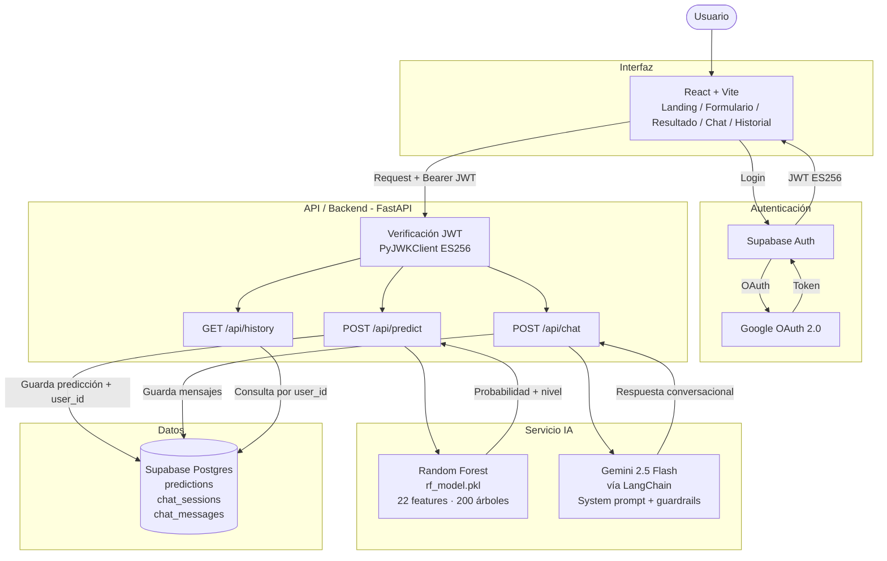

# Arquitectura Actual
**Proyecto:** GameVision IA  
**Semana:** 1

---

## Componentes actuales

| Componente | Tecnología | Responsabilidad | Estado |
|---|---|---|---|
| Interfaz | React 18 + Vite | Landing, formulario, resultado, chat, historial | Funcional |
| API / Backend | FastAPI (Python 3.11) | Expone endpoints REST, verifica JWT, orquesta IA | Funcional |
| Servicio IA — Predicción | Random Forest (scikit-learn) | Estima probabilidad de éxito con 22 features | Funcional |
| Servicio IA — Chat | Gemini 2.5 Flash + LangChain | Interpreta resultado y responde preguntas | Funcional |
| Datos | Supabase Postgres | Almacena predicciones, sesiones y mensajes por usuario | Funcional |
| Autenticación | Supabase Auth + Google OAuth | Login con Google, emisión y verificación de JWT ES256 | Funcional |
| Operación | .env + requirements.txt + package.json | Configuración de credenciales y dependencias | Manual |

---

## Diagrama de arquitectura actual

---

## Flujo básico de información

1. El usuario entra al landing y hace clic en "Analizar mi juego"
2. Supabase Auth redirige a Google OAuth; el usuario se autentica
3. Supabase emite un JWT (ES256) y lo entrega al frontend
4. El frontend llama a `POST /api/predict` con el JWT en el header `Authorization`
5. FastAPI verifica el JWT con PyJWKClient y extrae el `user_id`
6. El modelo Random Forest recibe las 22 features y devuelve una probabilidad
7. La predicción se guarda en Supabase Postgres con el `user_id` del usuario
8. El usuario puede chatear con Gemini 2.5 Flash, que interpreta el resultado
9. Los mensajes se guardan en `chat_messages` vinculados a la sesión

---

## Dependencias manuales y puntos frágiles

- `rf_model.pkl` debe copiarse manualmente a `backend/` (no está en el repo)
- La memoria de conversación del chatbot vive en RAM del servidor (`sessions_memory = {}`)
- El acceso OAuth está limitado a cuentas aprobadas manualmente (modo Testing)
- No existe ningún test automatizado
- No existe Docker ni script de despliegue
- El frontend y backend usan variables de entorno para configurar las URLs (`VITE_API_URL` en frontend y `ALLOWED_ORIGINS` en backend), manteniendo valores locales por defecto para desarrollo.
- Las tablas de Supabase requieren revisión de Row Level Security (RLS) y políticas por `user_id` antes de considerarse seguras para producción.
