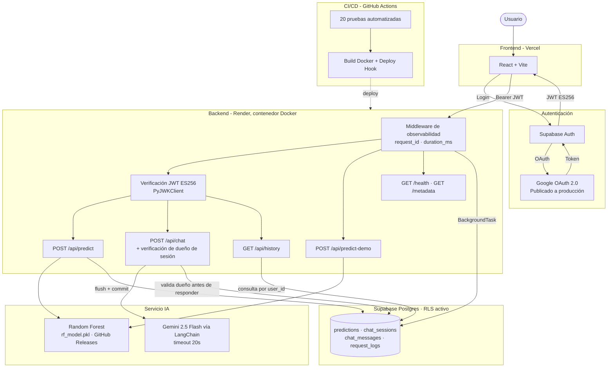

# Arquitectura Actual (Semana 6)
**Proyecto:** GameVision IA
**Estado:** Producción real, release `v1.0.0-rc.1`

> Este documento reemplaza la versión anterior de `arquitectura-actual.md`, que a pesar del nombre
> reflejaba el estado de **Semana 1** (entorno local, sin Docker, sin tests, sin observabilidad,
> sin controles de seguridad). Esa versión sigue siendo evidencia válida — es el "antes" para la
> narrativa de evolución del proyecto — y su contenido se conserva en `diagnostico-semana-1.md`
> y en el historial de git. Este documento es el "después": lo que realmente está corriendo hoy.

---

## Componentes actuales

| Componente | Tecnología | Responsabilidad | Estado |
|---|---|---|---|
| Interfaz | React 18 + Vite, desplegado en Vercel | Landing, formulario, resultado, chat, historial | Producción |
| API / Backend | FastAPI (Python 3.11), contenedor Docker en Render | Expone endpoints REST, verifica JWT, orquesta IA, observa cada request | Producción |
| Observabilidad | Middleware global + tabla `request_logs` en Supabase | `request_id`, `duration_ms`, versión del modelo, retención automática (`pg_cron`, 30 días) | Producción |
| Servicio IA — Predicción | Random Forest (scikit-learn, 200 árboles) | Estima probabilidad de éxito con 22 features | Producción |
| Servicio IA — Chat | Gemini 2.5 Flash + LangChain | Interpreta resultado y responde preguntas, timeout de 20s | Producción |
| Datos | Supabase Postgres, RLS activo en las 4 tablas públicas | Predicciones, sesiones, mensajes, logs — acceso controlado por backend y por RLS | Producción |
| Autenticación | Supabase Auth + Google OAuth (publicado, fuera de modo Testing) | Login con Google, cualquier cuenta, JWT ES256 | Producción |
| CI/CD | GitHub Actions | 20 pruebas automatizadas, Ruff, Deploy Hook automático a Render | Funcional |
| Versionado | Tag `v1.0.0-rc.1` + `release-manifest.yml` | Release identificable, trazable a un commit exacto | Publicado |

---

## Diagrama de arquitectura actual

```mermaid
flowchart TD
    U([Usuario]) --> FE

    subgraph Frontend [Frontend - Vercel]
        FE[React + Vite]
    end

    subgraph Auth [Autenticación]
        SA[Supabase Auth]
        GO[Google OAuth 2.0\nPublicado a producción]
    end

    FE -- Login --> SA
    SA -- OAuth --> GO
    GO -- Token --> SA
    SA -- JWT ES256 --> FE

    subgraph Backend [Backend - Render, contenedor Docker]
        MW[Middleware de observabilidad\nrequest_id · duration_ms]
        JWT_V[Verificación JWT ES256\nPyJWKClient]
        EP1[POST /api/predict]
        EP2[POST /api/predict-demo]
        EP3[POST /api/chat\n+ verificación de dueño de sesión]
        EP4[GET /api/history]
        HC[GET /health · GET /metadata]
    end

    FE -- Bearer JWT --> MW
    MW --> JWT_V
    JWT_V --> EP1
    JWT_V --> EP3
    JWT_V --> EP4
    MW --> EP2
    MW --> HC

    subgraph IA [Servicio IA]
        RF[Random Forest\nrf_model.pkl · GitHub Releases]
        GEM[Gemini 2.5 Flash vía LangChain\ntimeout 20s]
    end

    EP1 --> RF
    EP2 --> RF
    EP3 --> GEM

    subgraph Datos [Supabase Postgres · RLS activo]
        DB[(predictions · chat_sessions\nchat_messages · request_logs)]
    end

    EP1 -- flush + commit --> DB
    EP3 -- valida dueño antes de responder --> DB
    EP4 -- consulta por user_id --> DB
    MW -- BackgroundTask --> DB

    subgraph CICD [CI/CD - GitHub Actions]
        TEST[20 pruebas automatizadas]
        BUILD[Build Docker + Deploy Hook]
    end

    TEST --> BUILD
    BUILD -.deploy.-> Backend
```

---

## Evolución: de Semana 1 a Semana 6

| Aspecto | Semana 1 (diagnóstico) | Semana 6 (hoy) |
|---|---|---|
| Despliegue | Solo entorno local | Backend en Render (Docker), frontend en Vercel — ambos públicos |
| Pruebas | Ninguna | 20 pruebas automatizadas, incluyendo un caso adversarial real (IDOR) |
| Observabilidad | `print()` sin estructura | Middleware global + tabla `request_logs` con desglose por etapa y retención automática |
| Autenticación | OAuth en modo Testing (solo cuentas aprobadas a mano) | Publicado a producción — cualquier cuenta de Google |
| Seguridad de datos | RLS desactivado en Supabase | RLS activo en las 4 tablas públicas |
| Acceso a sesiones de chat | Sin verificar dueño (vulnerabilidad IDOR sin detectar) | Verificación de dueño, probada en producción real |
| Llamada a Gemini | Sin timeout (podía colgarse indefinidamente) | Timeout de 20s con error controlado |
| Versionado | Sin tags ni releases | `v1.0.0-rc.1` publicado, con manifiesto de componentes |
| Manejo de errores | Excepciones expuestas directo al cliente | Detalle real solo en logs; respuesta genérica y segura al cliente |

**Lo que el plan original (`arquitectura-objetivo.md`) no anticipó:** la observabilidad terminó siendo más completa de lo planeado — el plan original solo hablaba de reemplazar `print()` por `logging` estándar; se termino construyendo un middleware con persistencia estructurada, desglose por etapa y retención automática.

**Lo que quedó pendiente del plan original:** la API versionada bajo `/api/v1/` nunca se implementó — se declara como limitación conocida, no se oculta.
