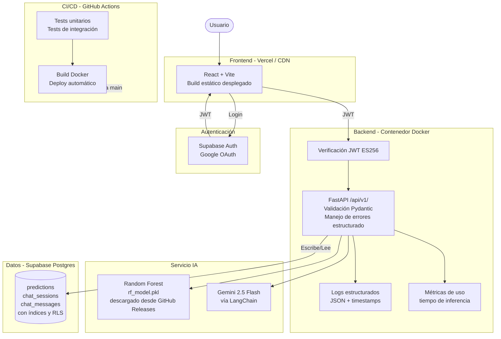

# Arquitectura Objetivo
**Proyecto:** GameVision IA  
**Horizonte:** 6 semanas (Módulo 4)

---

## Visión general

La arquitectura objetivo no cambia los componentes centrales sino que los hace más robustos, observables y desplegables. El modelo, el chatbot y la base de datos permanecen igual; lo que se agrega es estructura de API versionada, tests, contenedor Docker, logs y monitoreo.

---

## Diagrama de arquitectura objetivo

---

## Evolución por semana

### Semana 2 — API inteligente
- Mover rutas absolutas a variables de entorno (`VITE_API_URL` en frontend, `ALLOWED_ORIGINS` en backend)
- Versionar la API bajo `/api/v1/`
- Documentar contratos de entrada/salida (schemas Pydantic completos)
- Mejorar manejo de errores y respuestas estructuradas
- Validar y rechazar inputs malformados antes de llegar al modelo

### Semana 3 — Pruebas y CI/CD
- Escribir tests unitarios para la función de predicción
- Escribir tests de integración para los endpoints principales
- Configurar GitHub Actions para correr tests en cada push
- Agregar badge de estado al README

### Semana 4 — Contenedor y despliegue
- Crear `Dockerfile` para el backend (Python 3.11 + imagen slim + dependencias)
- Subir `rf_model.pkl` como asset a un GitHub Release; el Dockerfile lo descarga con `wget` al construir la imagen
- Desplegar frontend en Vercel conectando el repositorio de GitHub (sin Docker, automático)
- Desplegar backend en Render con el Dockerfile (un solo contenedor)
- Evaluar el uso de UptimeRobot o health checks externos para monitorear disponibilidad del backend durante la demo.

### Semana 5 — Observabilidad y rendimiento
- Reemplazar `print()` por `logging` estándar de Python (INFO, ERROR, timestamps); Render los captura automáticamente en su dashboard sin servicios externos
- Registrar tiempo de inferencia del modelo y tiempo de respuesta de Gemini
- Persistir memoria de conversación del chatbot en base de datos (eliminar `sessions_memory`; la tabla `chat_messages` ya existe)
- Agregar endpoint `GET /health` que verifique que el modelo está cargado y la DB responde

### Semana 6 — Seguridad y defensa
- Revisar exposición de errores en respuestas de la API
- Auditar políticas Row Level Security (RLS) en Supabase y validar acceso por `user_id`
- Publicar la app OAuth (salir del modo Testing de Google Cloud)
- Preparar documentación final y evidencias para la defensa técnica
