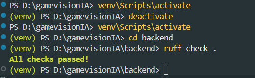
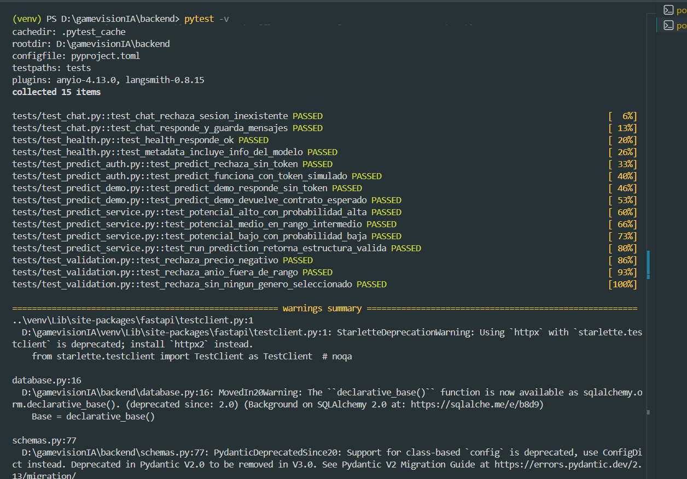
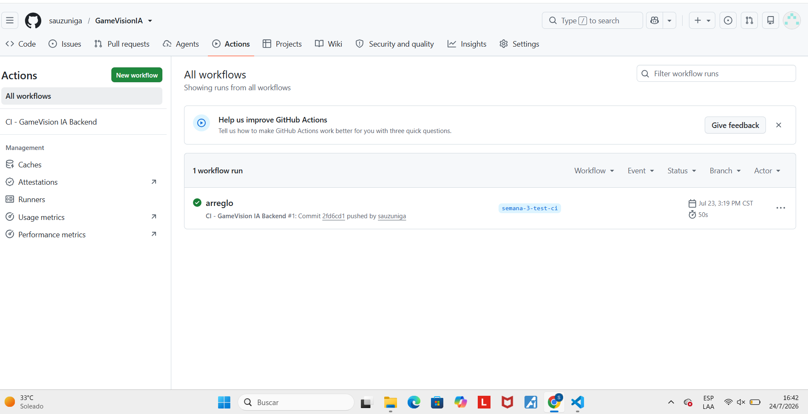
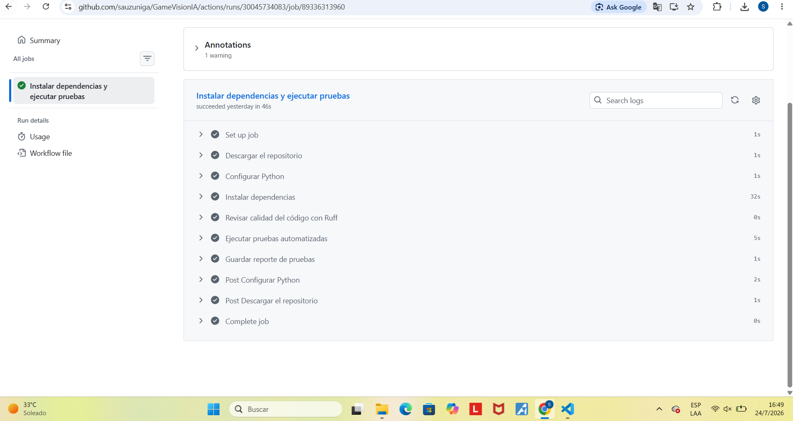

# Registro de errores, correcciones y decisiones — Semana 3

Este documento registra los problemas técnicos reales encontrados al implementar
pruebas automatizadas y CI/CD sobre el backend de GameVision IA, y cómo se
resolvieron.

## 1. `requirements.txt` guardado en codificación incorrecta (UTF-16)

**Problema:** el archivo se había generado con `pip freeze > requirements.txt`
en PowerShell, que por defecto redirige la salida en UTF-16 en vez de UTF-8.
Esto podria haber hacer fallar la instalación de dependencias en GitHub Actions,
ya que `pip` espera archivos de texto plano en UTF-8.

**Diagnóstico:**

```
requirements.txt: Unicode text, UTF-16, little-endian text, with CRLF line terminators
```

**Corrección aplicada:**

```powershell
pip freeze | Out-File -Encoding utf8 requirements.txt
```

Verificado con `Get-Content requirements.txt -Encoding utf8 | Select-Object -First 5`,
confirmando texto plano legible sin caracteres extraños.

## 2. Hallazgos de calidad de código con Ruff (41 → 0)

Al correr `ruff check .` por primera vez sobre el proyecto, se encontraron
**41 errores**, agrupados en 4 categorías:

| Código | Cantidad | Descripción | Resolución |
|---|---|---|---|
| `I001` | 8 | Imports desordenados | Corregido automáticamente con `ruff check . --fix` |
| `F401` / `F841` | 2 | Variables o imports sin usar | Corregido automáticamente |
| `B008` | 6 | Ruff marca `Depends(...)` / `Security(...)` como valor por defecto | **Ignorado a propósito** — es el patrón oficial de FastAPI para inyección de dependencias, no un error real. Se configuró `ignore = ["B008"]` en `pyproject.toml`. |
| `B904` | 5 | Excepciones relanzadas sin conservar el error original (`raise ... from err`) | Corregido manualmente en `auth.py` y `routers/predict.py`, agregando `from exc` a cada `raise HTTPException(...)` dentro de un `except`. |
| `E501` | 15 | Líneas mayores a 100 caracteres | 12 correspondían al *system prompt* del chatbot (`routers/chat.py`) y un mensaje de advertencia (`services/predict_service.py`) — se excluyeron con `per-file-ignores`, ya que son texto, no lógica. 3 eran consultas de SQLAlchemy mal formateadas en `routers/history.py` — se reformatearon en varias líneas. |

**Resultado final:**

```
ruff check .
All checks passed!
```

## 3. Decisión de diseño: simular modelo, base de datos y LLM en las pruebas

**Contexto:** el backend depende de tres recursos externos que no deben
usarse directamente durante las pruebas automatizadas:

- El modelo `rf_model.pkl` (63MB, no versionado en el repositorio)
- La base de datos real de Supabase (Postgres)
- El modelo de lenguaje Gemini (llamada de red, costo, respuesta no determinística)

**Riesgo si se usaran los reales en CI:** dependencia de conexión a internet
y credenciales reales dentro de GitHub Actions, inserción de datos de prueba
en la base de datos de producción, pruebas lentas y no reproducibles (una IA
generativa no responde lo mismo dos veces).

**Solución aplicada (`tests/conftest.py`):**

- `DATABASE_URL` se sobrescribe a `sqlite:///./test.db` solo durante las pruebas.
- El modelo Random Forest se reemplaza con `unittest.mock.MagicMock`,
  configurado para devolver una probabilidad fija y así poder verificar que
  la API arma la respuesta correctamente.
- El LLM de Gemini se reemplaza con `FakeListChatModel` de LangChain
  (herramienta oficial de la librería para pruebas), que devuelve una
  respuesta fija sin llamar a la API real de Google.

Esto no requiere cambios para el despliegue real en Semana 4: la configuración
de producción (Supabase real, modelo real, Gemini real) sigue viviendo en las
variables de entorno de Render, completamente separada de `tests/`.

## 4. Resultado final

Ejecución local:

```
pytest -v
============================== 15 passed, 5 warnings in 2.34s ==============================
```

Confirmado también en GitHub Actions, corriendo sobre una máquina limpia de Ubuntu:

```
collected 15 items
tests/test_chat.py::test_chat_rechaza_sesion_inexistente PASSED
tests/test_chat.py::test_chat_responde_y_guarda_mensajes PASSED
tests/test_health.py::test_health_responde_ok PASSED
tests/test_health.py::test_metadata_incluye_info_del_modelo PASSED
tests/test_predict_auth.py::test_predict_rechaza_sin_token PASSED
tests/test_predict_auth.py::test_predict_funciona_con_token_simulado PASSED
tests/test_predict_demo.py::test_predict_demo_responde_sin_token PASSED
tests/test_predict_demo.py::test_predict_demo_devuelve_contrato_esperado PASSED
tests/test_predict_service.py::test_potencial_alto_con_probabilidad_alta PASSED
tests/test_predict_service.py::test_potencial_medio_en_rango_intermedio PASSED
tests/test_predict_service.py::test_potencial_bajo_con_probabilidad_baja PASSED
tests/test_predict_service.py::test_run_prediction_retorna_estructura_valida PASSED
tests/test_validation.py::test_rechaza_precio_negativo PASSED
tests/test_validation.py::test_rechaza_anio_fuera_de_rango PASSED
tests/test_validation.py::test_rechaza_sin_ningun_genero_seleccionado PASSED
======================== 15 passed, 5 warnings in 2.34s ========================
```



